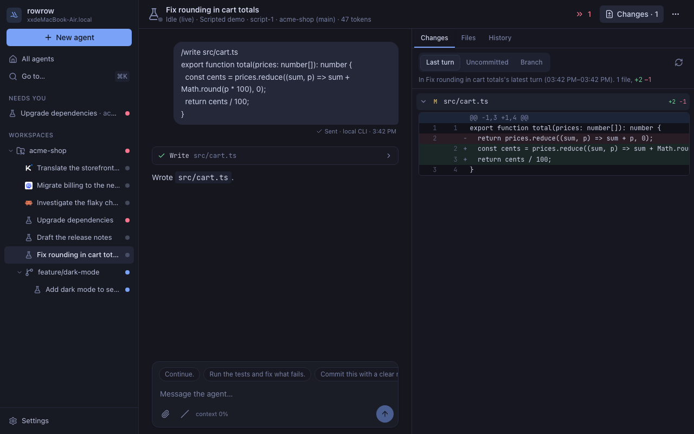
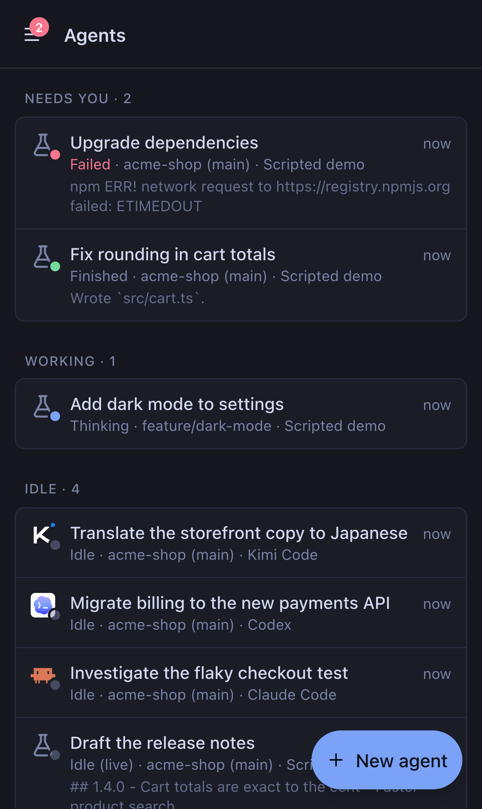
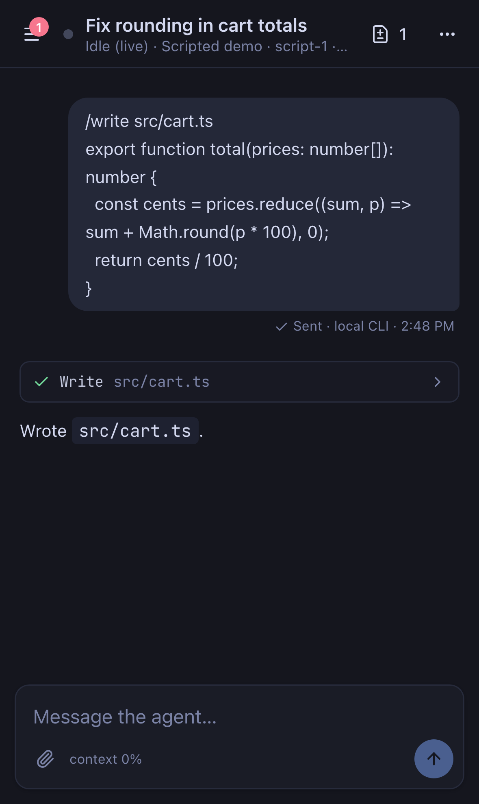

<p align="center"></p>

# rowrow

Run a crew of coding agents in parallel (Claude Code, Codex, Grok, Kimi, Pi) on your
machine, and steer them from any browser, including your phone.

rowrow borrows [herdr](https://herdr.dev)'s idea: a long-lived server owns your agents,
and every screen is organized around one question, *who needs me now?* It drops the
terminal. Agents are driven through their programmatic interfaces with
[oar](https://github.com/botiverse/oar), so status comes from the agent itself (never from
screen scraping), transcripts are structured, and a phone on a flaky network is a
first-class client.

<p align="center">
  
</p>
<p align="center">
  
  &nbsp;
  
</p>

- **Attention first.** Every agent is `blocked`, `done` (finished and you haven't looked),
  `working` or `idle`. Lists sort by it; you get a notification when an agent finishes or
  needs you, and never for the one you're looking at.
- **Agents outlive the browser.** Close the tab, lose Wi-Fi, switch to your phone: work
  continues, and every client resumes exactly where it left off.
- **Talk to them anywhere.** Send, steer a running turn, queue for the next one, or stop.
  A retried send is never delivered twice.
- **See what they changed, and answer in place.** The *last turn* diff shows exactly what
  an agent's latest turn changed (snapshots at its start and end, stored outside your
  repository), apart from your own work; uncommitted and whole-branch scopes too. Comment
  on diff lines, or select a passage the agent wrote and comment on that: your comments
  become one review message in the agent's composer.
- **Hand them anything.** Paste or drop a screenshot or a log; it's uploaded to the
  machine and mentioned by path.
- **Parallel work in worktrees.** One click makes a git worktree on a fresh branch from
  origin's default branch, grouped under its repository, with your repo's setup hooks.
- **Built to be debugged by agents.** Everything the UI does is a typed API the `rowrow`
  CLI exposes; every action carries a trace id through structured logs; browser errors land
  in the server log; any transcript can be re-rendered from its log.

## Quick start

Needs Node.js 24 or later, git, and at least one agent CLI you're already signed in to
(`claude`, `codex`, `grok`, `kimi` or `pi`).

```bash
npm install -g rowrow
rowrow serve                   # serves rowrow on http://127.0.0.1:7373
```

`rowrow serve` prints a one-time sign-in link; open it. Later, `rowrow open` signs a
browser in and opens it. rowrow has no passwords: browsers sign in with one-time links, and
every signed-in device can be revoked in Settings. Keyboard: ⌘K goes anywhere, ⌘J goes to
the next agent that needs you.

To keep it running without a terminal (it starts when you log in and restarts after a
crash), run it as a service instead, with the same flags as `serve`:

```bash
rowrow service install         # launchd on macOS, systemd on Linux
rowrow service status          # also: restart (after npm install -g rowrow), uninstall
```

The service runs the `node` it was installed with, so install it again after switching
Node versions.

### From source

To work on rowrow (read [AGENTS.md](AGENTS.md)), you also need pnpm:

```bash
git clone https://github.com/xxchan/rowrow && cd rowrow
pnpm install
pnpm start                     # builds the web app and serves it on http://127.0.0.1:7373
```

In a checkout, `pnpm rowrow …` is the CLI: `pnpm rowrow open`, for example, or
`pnpm build && pnpm rowrow service install` to run the checkout as the service. Try it
without spending tokens: `pnpm dev` runs a development server with a scripted demo agent,
and `node scripts/demo.ts --profile dev` fills it with a few agents in every state.

## On your phone

rowrow listens on `127.0.0.1` until you decide otherwise, and every request needs a device
credential even then. The simplest safe way to reach it from your phone is
[Tailscale](https://tailscale.com):

```bash
tailscale serve --bg 7373
rowrow service install --public-url https://<machine>.<tailnet>.ts.net   # or: rowrow serve
```

Then open **Settings → Pair a device** and scan the code with your phone. Over HTTPS the
phone can also get push notifications (on iPhone: *Add to Home Screen* first, then turn
them on in Settings). Other options: `--host 0.0.0.0` on a trusted LAN (plain HTTP: no push
notifications), `--tls-cert/--tls-key` for HTTPS directly, or a tunnel such as
`cloudflared tunnel --url http://127.0.0.1:7373`. Anyone who can sign in can run commands
on this machine through its agents: guard your pairing links.

## The CLI

Everything the UI can do is scriptable, which is also how agents coordinate other agents
(rowrow gives each agent `ROWROW_URL` and `ROWROW_TOKEN`):

```bash
rowrow agents                                      # attention-sorted
rowrow agent new ~/code/app "Fix the flaky test" --runtime codex --wait
rowrow agent send <agent> "also update the changelog" --wait
rowrow agent view <agent>                          # the transcript, as the UI shows it
rowrow ws pr ~/code/app                            # the branch's pull request: checks, review (via gh)
rowrow ws search ~/code/app "TODO"                 # file names and lines, .gitignore honored
rowrow logs --since 30m --level warn
rowrow help
```

`<agent>` is an id, an id prefix, or part of its title.

## How it works

A server per machine (Node 24) owns agents through oar and keeps each agent's append-only
log in SQLite. Status, attention and transcripts are pure folds over that log, shared by
the server, the web app and the CLI. Browsers hold one WebSocket (oRPC) for live state;
the CLI and agents use the same procedures over HTTP (OpenAPI at `/api/openapi.json`). The
web app is React with Tailwind and [shadcn/ui](https://ui.shadcn.com) components.

- [PRINCIPLES.md](PRINCIPLES.md): the rules that settle arguments
- [docs/architecture.md](docs/architecture.md): the system design
- [docs/decisions.md](docs/decisions.md): every decision, its reasons, and when to revisit it
- [AGENTS.md](AGENTS.md): working on rowrow (for people and coding agents)

## Status

Early and moving fast: no compatibility promises before 1.0. Agents currently run without
approval prompts (as with oar's defaults), so give them repositories you'd give a
colleague, ideally in worktrees. Approvals from your phone are next.

Apache-2.0
